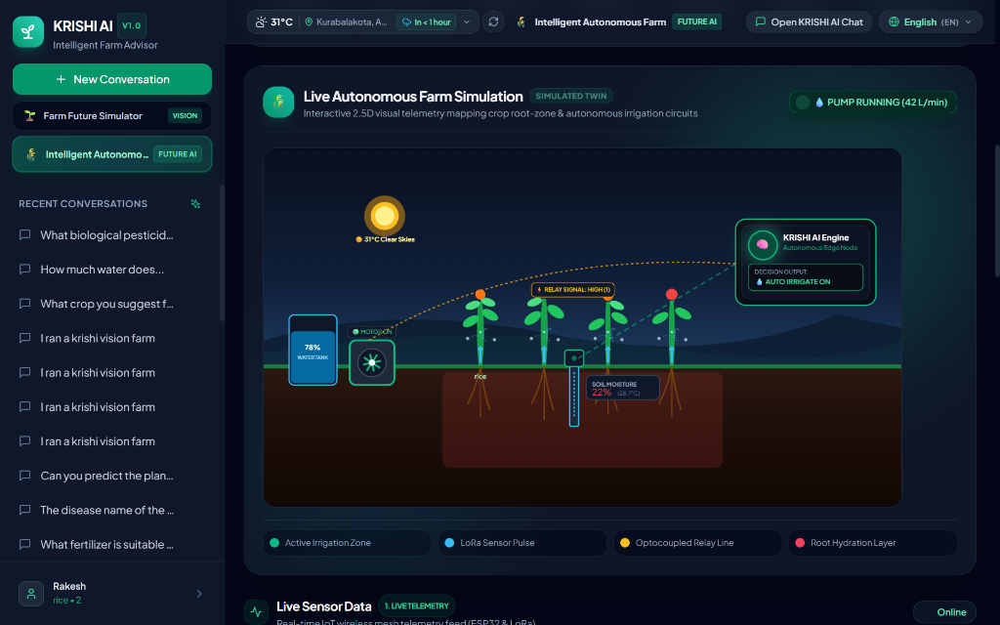
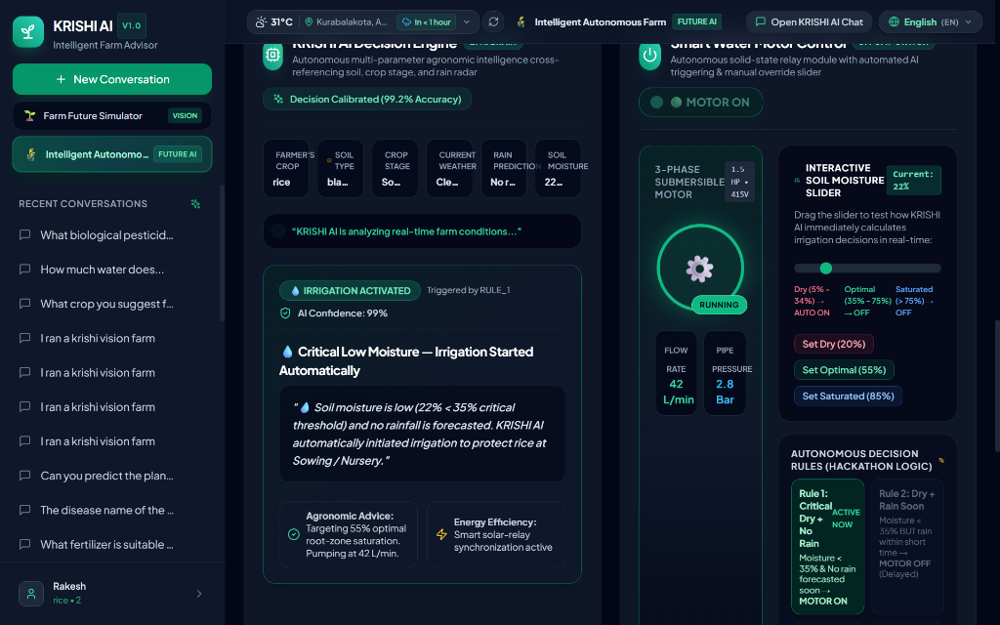
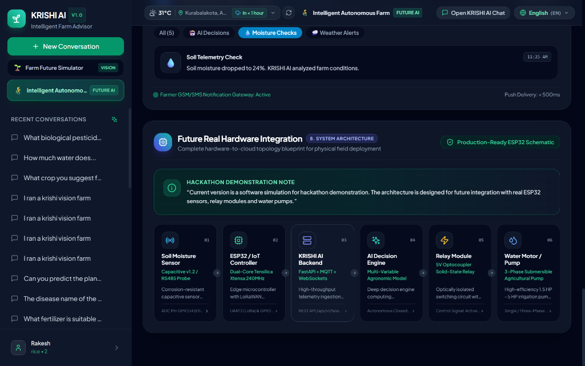
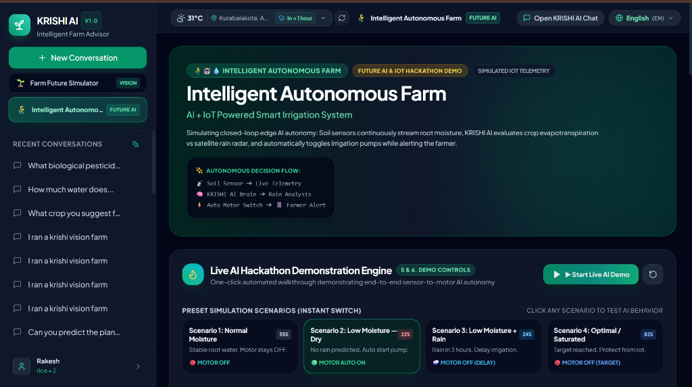

# 🌾 KRISHI AI — Multilingual AI Farmer Advisory & Farm Future Simulator

<div align="center">


### **Empowering Smallholder Farmers with Predictive Agronomic Simulations, AI Plant Disease Detection with Image or Camera, and Multilingual Indian Language Intelligence**

---

[](https://www.python.org/)
[](https://www.typescriptlang.org/)
[](https://developer.mozilla.org/en-US/docs/Web/JavaScript)
[](https://reactjs.org/)
[](https://fastapi.tiangolo.com/)
[](https://pytorch.org/)
[](https://tailwindcss.com/)
[](https://www.sqlite.org/)
[](LICENSE)

[🌟 Executive Summary](#-executive-summary--judge-evaluation-sheet) • [📸 Output Visual Showcase](#-output--visual-showcase) • [🌾 Intelligent Autonomous Farm](#-deep-dive-krishi-ai-future-intelligent-autonomous-farm) • [🔮 KRISHI VISION Simulator](#-deep-dive-krishi-vision-farm-future-simulator) • [🔬 AI Plant Disease Detection](#-ai-plant-disease-detection-with-image-or-camera) • [🗣️ Multilingual Voice AI](#-multilingual-voice--generative-ai-rag) • [🏛️ Architecture & Pipelines](#️-system-architecture--data-pipelines) • [💻 Technical Languages & Stack](#-technical-programming-languages--technology-stack) • [📐 Math Models](#-mathematical--agronomic-formulations) • [📡 API Reference](#-rest-api-documentation) • [🚀 Quick Start](#-quick-start--installation-guide)

</div>

---

## 🏆 Executive Summary & Judge Evaluation Sheet

Smallholder farmers in India confront high volatility due to climate unpredictability, volatile mandi commodity rates, and localized pest infestations. Most existing agricultural apps are simple lookup databases or text bots that require high literacy and provide static information.

**KRISHI AI** is a complete decision-support & autonomous platform built around four key innovations:

```
┌────────────────────────────────────────────────────────────────────────────────────────────────────────┐
│                                           KRISHI AI PILLARS                                            │
├──────────────────────────┬──────────────────────────┬──────────────────────────┬───────────────────────┤
│ 1. AUTONOMOUS FARM TWIN  │ 2. KRISHI VISION SIM     │ 3. EDGE COMPUTER VISION  │ 4. MULTILINGUAL VOICE │
│ AI + IoT Smart           │ Real-time "What-If"      │ MobileNetV2 diagnosing   │ Native speech &       │
│ Irrigation telemetry,    │ Agronomic, Financial,    │ 38 leaf disease classes  │ multi-script LLM with │
│ rain radar & pump relays │ & Climate Simulator      │ with organic cures       │ verifiable citations  │
└──────────────────────────┴──────────────────────────┴──────────────────────────┴───────────────────────┘
```

### 🎯 Quick Evaluation Matrix for Judges

| Evaluation Dimension | Traditional Agricultural Solutions | KRISHI AI Advisory & Simulator |
| :--- | :--- | :--- |
| **Risk Management** | Reactive (recommends cures after damage occurs) | **Predictive (simulates drought, price crashes, & monsoon delays before sowing)** |
| **User Accessibility** | Text-heavy English/Hindi UI | **Voice STT/TTS with 10+ Indian language scripts & regional dialects** |
| **Diagnostic Speed** | Remote human consultation (24–72 hours) | **On-device/Edge MobileNetV2 Deep Learning inference (< 120ms)** |
| **Financial Intelligence**| Generic yield numbers per hectare | **Dynamic P&L, ROI %, Cultivation Cost breakdown, and MSP sensitivity** |
| **Agronomic Accuracy** | Unverified generative LLM hallucinations | **Curated Agronomic Knowledge Base + Vector RAG + Evapotranspiration models** |

---

## 📸 Output & Visual Showcase

### 1. 🔮 Flagship Innovation — KRISHI VISION (AI Farm Future Simulator)
*Interactive "What-If" climate, market, and budget scenario simulator comparing multi-crop yield, ROI, water consumption, and AI viability scores.*


> **Key Output Elements Highlighted:**
> - **Quick Presets**: *Drought Stress*, *Rain Delay*, *Market Boom*, *Low Budget*, *Reset to Baseline*.
> - **Interactive Telemetry Sliders**: Water Availability (`80%`), Monsoon Delay (`0d`), Temperature Anomaly (`0°C`), Mandi Price Shift (`0%`).
> - **Best AI Recommendation Card**: Ranked Groundnut (*Peanut*) with AI Score `96/100`, Net Profit `₹1,38,106`, ROI `313.9%`, Water requirement `550 mm`, and localized Telugu advisory.
> - **3-Crop Side-by-Side Comparison**: Comparing Groundnut vs Rice (Paddy) across profits, costs, water requirements, and risk levels.

---

### 2. 🌾 Smart Agronomic Dashboard & Real-Time Microclimate Telemetry
*Real-time GPS reverse-geocoding (Kurabalakota, 26°C, Overcast, Rain in 5 hours), farmer land profile chips, and one-tap multilingual quick prompt chips.*


---

### 3. 👨‍🌾 Farmer Context & Soil Profile Engine
*Tracks individual farmer land area (Acres), soil classification (Black, Red Loamy, Clay, Sandy, Alluvial), primary crop, growth stage, and preferred language.*


---

### 4. 🔬 AI Plant Disease Detection with Image or Camera
*Instant leaf diagnosis via live device camera snap or gallery photo upload. MobileNetV2 neural vision model detecting plant leaf disease with confidence score (96.8%), causes, biological/organic remedies, and chemical fungicide protocols.*


---

### 5. 🗣️ Multilingual Conversational AI & Voice Intelligence
*Multi-turn question answering in native Devanagari Hindi and Indian scripts with integrated Voice-to-Text and neural Text-to-Speech audio playback.*


---

### 6. 💧 Water-Conserving Crop Planning & Drought Advisory
*Intelligent crop recommendations specifically optimized for rainfed, arid, and drought-prone regions.*


---

### 7. 🌾🤖💧 Flagship Innovation — Intelligent Autonomous Farm (AI + IoT Smart Irrigation Simulation)
*Interactive 2.5D visual farm twin with embedded capacitive soil moisture probes, LoRa wireless pulses, KRISHI AI edge brain hub, relay triggers, and animated high-pressure water pipe flow.*



> **Key Elements in Farm Twin:**
> - **Active Root-Zone Hydration**: Capacitive RS485 probe embedded at 15cm soil depth streaming real-time moisture (`22%`) and soil temp (`28.7°C`).
> - **Autonomous KRISHI AI Brain Node**: Evaluates crop water consumption against satellite rainfall radar and actuates the solid-state relay.
> - **Animated Water Flow & Sprinklers**: Dynamic water flow lines and active spray droplets when the 1.5HP pump is triggered (`42 L/min`, `2.8 Bar`).

---

### 8. 🧠 AI Decision Engine & Interactive Moisture Slider Pump Control
*Real-time agronomic multi-variable engine cross-referencing farmer crop profile, soil type, and rain radar with instant manual moisture slider testing.*



> **Key Output Elements Highlighted:**
> - **6 Real-Time Inputs Context Bar**: Farmer's Crop (`Rice`), Soil Type (`Black Clay`), Crop Stage (`Sowing / Nursery`), Current Weather (`Clear & Sunny`), Rain Prediction (`No rain in 7 days`), and Soil Moisture (`22%`).
> - **Live AI Reasoning Output**: *“Soil moisture is low (22% < 35% critical threshold) and no rainfall is forecasted. KRISHI AI automatically initiated irrigation to protect rice at Sowing / Nursery.”*
> - **Interactive Moisture Slider (`0% - 100%`)**: Real-time evaluation as slider is moved, enforcing autonomous decision rules.
> - **3-Phase Submersible Motor Card**: Industrial pumping metrics showing flow rate (`42 L/min`), line pressure (`2.8 Bar`), and active safety load lock.

---

### 9. 📱 Real-Time Farmer SMS/App Notification Feed & Hardware Architecture
*Dynamic alert feed dispatched to farmer's phone during autonomous irrigation cycles alongside production-ready ESP32 hardware topology.*



> **Key Output Elements Highlighted:**
> - **Farmer Notification Feed**: Filterable logs with timestamped alerts (`💧 Soil Telemetry Check: Moisture dropped to 24%...`, `🤖 Autonomous Irrigation Started`, `🌧️ Rain detected in forecast. Irrigation stopped to save water`).
> - **Future Real Hardware Integration**: 6-node physical architecture blueprint from Capacitive Probe ➔ ESP32 Controller ➔ KRISHI AI Backend ➔ AI Engine ➔ Relay Module ➔ Submersible Pump.

---

### 10. 🚀 Live AI Hackathon Demonstration Engine & Preset Scenarios
*Automated 7-step presentation mode and 4 one-click scenario presets designed for live hackathon jury evaluation.*



> **Key Output Elements Highlighted:**
> - **▶ Start Live AI Demo**: One-click automated 7-step sequence walking through sensor ingestion, profile matching, weather check, radar scan, AI neural decision, motor actuation, and farmer alert delivery.
> - **4 Instant Simulation Scenarios**: *Scenario 1: Normal Moisture (55%)*, *Scenario 2: Low Moisture — Dry (22%)*, *Scenario 3: Low Moisture + Rain in 3h (24%)*, *Scenario 4: Optimal / Saturated (82%)*.

---

## 🌾🤖💧 Deep Dive: KRISHI AI Future (Intelligent Autonomous Farm)

Traditional agriculture relies on manual guess-based borewell pumping, causing catastrophic groundwater depletion or root suffocation during unpredicted rainfall.

**KRISHI AI Future: Intelligent Autonomous Farm** elevates KRISHI AI from a conversational advisor into an **autonomous edge-AI farm management platform**. It simulates a closed-loop AI + IoT smart irrigation ecosystem that makes decisions using live crop root sensors, microclimate evapotranspiration, and satellite rain radar.

```
                     COMPLETE AUTONOMOUS IRRIGATION FLOW
        ┌─────────────────────────────────────────────────────────────┐
        │  📡 Soil Moisture Sensor Probe (Capacitive RS485 / 15cm)     │
        └──────────────────────────────┬──────────────────────────────┘
                                       │
                                       ▼
        ┌─────────────────────────────────────────────────────────────┐
        │  📶 ESP32 / LoRaWAN Microcontroller & Telemetry Telecasting │
        └──────────────────────────────┬──────────────────────────────┘
                                       │
                                       ▼
        ┌─────────────────────────────────────────────────────────────┐
        │  🧠 KRISHI AI Decision Engine (Multi-Variable Crop Model)   │
        └──────────────────────────────┬──────────────────────────────┘
                                       │
                                       ▼
        ┌─────────────────────────────────────────────────────────────┐
        │  🌧️ Live Meteorological & Satellite Rain Radar Analysis     │
        └──────────────────────────────┬──────────────────────────────┘
                                       │
                                       ▼
        ┌─────────────────────────────────────────────────────────────┐
        │  ⚡ Autonomous Actuation: Solid-State Relay ➔ Motor ON/OFF  │
        └──────────────────────────────┬──────────────────────────────┘
                                       │
                                       ▼
        ┌─────────────────────────────────────────────────────────────┐
        │  📱 Farmer SMS, WhatsApp & Push Notification Feed           │
        └─────────────────────────────────────────────────────────────┘
```

### 🧠 The 4 Core Autonomous AI Decision Rules

The decision engine evaluates the continuous root-zone soil moisture ($M_{\text{soil}}$), upcoming rainfall forecast arrival ($T_{\text{rain}}$), and precipitation probability ($P_{\text{rain}}$):

```
                                    AI DECISION LOGIC TREE
                                               │
                                               ▼
                             Is Soil Moisture M_soil < 35%?
                                    /               \
                                 YES                 NO
                                 /                     \
                   Is Rain Forecasted Soon?             Is M_soil > 75%?
                  (T_rain ≤ 5h & P_rain ≥ 50%)          /              \
                         /           \                YES               NO
                       YES            NO               │                 │
                        │              │               ▼                 ▼
                        ▼              ▼           [ RULE 4 ]        [ RULE 3 ]
                   [ RULE 2 ]     [ RULE 1 ]     EXCESS MOISTURE   OPTIMAL MOISTURE
                   DELAY RAIN      MOTOR ON       MOTOR LOCKED OFF    MOTOR OFF
```

| Decision Rule | Trigger Conditions | Motor Output | AI Reasoning & Agronomic Action |
| :--- | :--- | :---: | :--- |
| **Rule 1: Critical Dry + No Rain** | $M_{\text{soil}} < 35\%$ **AND** ($T_{\text{rain}} > 6\text{h}$ or $P_{\text{rain}} < 40\%$) | **🟢 MOTOR ON** | *“💧 Soil moisture dropped to 22%. Zero rainfall expected. Pump started automatically at 42 L/min to prevent crop wilting.”* |
| **Rule 2: Low Moisture + Rain Forecast** | $M_{\text{soil}} < 35\%$ **AND** ($T_{\text{rain}} \le 5\text{h}$ and $P_{\text{rain}} \ge 50\%$) | **🔴 MOTOR OFF** *(Delayed)* | *“🌧️ Rain is expected in 3 hours (85% prob). KRISHI AI delayed irrigation to save ~1,450L of water and let nature replenish soil.”* |
| **Rule 3: Optimal Hydration** | $35\% \le M_{\text{soil}} \le 75\%$ | **🔴 MOTOR OFF** *(Standby)* | *“✅ Optimal root-zone hydration maintained (55%). Evapotranspiration balanced. Irrigation motor safely shut down.”* |
| **Rule 4: Excess Moisture Warning** | $M_{\text{soil}} > 75\%$ | **🔴 MOTOR OFF** *(Safeguard)* | *“⚠️ Excess water detected (82%). Motor locked OFF to protect roots from fungal infection, root rot, and fertilizer leaching.”* |

---

### 🚀 Automated 7-Step Hackathon Live AI Demo Runner
The dashboard features a **`▶ Start Live AI Demo`** button engineered for live hackathon jury presentations:
1. **Step 1: Reading soil sensor...** ➔ RS485 capacitive probe streams real-time moisture (`22%`) and root temperature (`29°C`).
2. **Step 2: Checking farmer profile...** ➔ Pulls crop classification (*Rice/Tomato*), soil type (*Black Clay*), and growth stage (*Nursery*).
3. **Step 3: Checking weather conditions...** ➔ Evaluates ambient microclimate (`35°C`, `42% RH`) and evaporation index.
4. **Step 4: Checking rain prediction...** ➔ Scans Open-Meteo satellite radar for precipitation probability.
5. **Step 5: KRISHI AI is making a decision...** ➔ Evaluates water deficit vs rain buffer to compute optimal actuation.
6. **Step 6: Irrigation started or delayed...** ➔ Optocoupled relay trips; 3-phase pump activates with animated pipeline spray flow.
7. **Step 7: Farmer notification sent.** ➔ Instant SMS and push notification dispatched to the farmer's mobile device.

---

### ⚙️ Production-Ready Future Real Hardware Topology

```
┌───────────────────────────────────────────────────────────────────────────────────────────────────────┐
│                                  HARDWARE INTEGRATION ARCHITECTURE                                    │
├─────────────────────────┬─────────────────────────┬─────────────────────────┬─────────────────────────┤
│ 1. Capacitive Probe     │ 2. ESP32 Controller     │ 3. 5V Relay Switch      │ 4. Submersible Pump     │
│ • Industrial RS485      │ • Tensilica 240MHz      │ • 10A Optocoupler       │ • 1.5 HP - 5 HP 3-Phase │
│ • 15cm Root Placement   │ • LoRaWAN 868/915 MHz   │ • Flyback Diode Safety  │ • Flow: 42-200 L/min    │
│ • Analog 0-3.3V GPIO34  │ • MQTT over TLS 1.3     │ • Signal GPIO26 Out     │ • Drip & Sprinkler Grid │
└─────────────────────────┴─────────────────────────┴─────────────────────────┴─────────────────────────┘
```

> **📌 Hackathon Demonstration Note:**
> *Current version is a high-fidelity software twin and simulation designed for hackathon demonstration. The architecture is engineered for direct plug-and-play integration with physical ESP32 microcontrollers, solid-state relays, and industrial water pumps.*

---

## 🔮 Deep Dive: KRISHI VISION (Farm Future Simulator)

Smallholder farmers frequently lose their entire seasonal capital when monsoon rains arrive 30 days late or market prices crash at harvest. **KRISHI VISION** solves this problem by providing a real-time parametric simulation engine.

```
                                  SIMULATION PARAMETERS
               ┌───────────────────────────┼───────────────────────────┐
               ▼                           ▼                           ▼
      [ Water Level: 0-100% ]     [ Rain Delay: 0-60d ]     [ Temp Delta: -5°C to +5°C ]
               │                           │                           │
               └───────────────────────────┼───────────────────────────┘
                                           ▼
                           AGRONOMIC CALCULATION ENGINE
                                           │
         ┌─────────────────────────────────┼─────────────────────────────────┐
         ▼                                 ▼                                 ▼
[ Evapotranspiration ETc ]        [ Yield Attenuation Ky ]        [ MSP Price Elasticity ]
         │                                 │                                 │
         └─────────────────────────────────┼─────────────────────────────────┘
                                           ▼
                               MULTI-CROP OUTCOME MATRIX
                                           │
   ┌───────────────────────┬───────────────┴───────────────┬───────────────────────┐
   ▼                       ▼                               ▼                       ▼
Net Profit (₹)          ROI (%)                     Water Stress Index          AI Score (0-100)
```

### 🎛️ Simulation Parameters & Sliders
1. **Available Water Level ($W_{\text{avail}} \in [0\%, 100\%]$)**: Models severe drought conditions ($0\%$), limited borewell/canal water ($50\%$), or unrestricted irrigation ($100\%$).
2. **Rain Delay / Monsoon Lag ($D_{\text{rain}} \in [0, 60\text{ days}]$)**: Simulates delayed sowing windows, reducing vegetative growth duration and grain-filling periods.
3. **Temperature Delta ($\Delta T \in [-5^{\circ}\text{C}, +5^{\circ}\text{C}]$)**: Evaluates thermal stress thresholds, pollen sterility, and high transpiration rates.
4. **Market Price Shift ($\Delta P \in [-50\%, +50\%]$)**: Simulates bumper harvest market gluts, MSP procurement guarantees, or supply shortages.
5. **Farm Budget & Acreage ($B_{\text{farm}}, A_{\text{acres}}$)**: Enforces input cost caps for fertilizers, seeds, and labor per acre.

---

## 📐 Mathematical & Agronomic Formulations

### 1. Water Stress & Evapotranspiration Modeling
Crop water demand is determined using the FAO-56 Penman-Monteith methodology:
$$ET_c = K_c \times ET_0$$
Where:
- $ET_c$: Crop evapotranspiration requirement (mm)
- $K_c$: Crop coefficient across vegetative/flowering stages
- $ET_0$: Reference evapotranspiration derived from live weather telemetry

The **Water Deficit Attenuation Factor ($K_s$)** is calculated as:
$$K_s = \max\left(0.1, \min\left(1.0, \frac{W_{\text{avail}} \times \text{Rainfall}_{\text{expected}}}{ET_c}\right)\right)$$

### 2. Yield Reduction Equation (FAO Stewart Model)
The adjusted harvest yield per acre ($Y_{\text{actual}}$) is computed as:
$$Y_{\text{actual}} = Y_{\text{base}} \times \left[ 1 - K_y \times (1 - K_s) \right] \times \left(1 - \frac{D_{\text{rain}}}{120}\right) \times \text{ThermalPenalty}(\Delta T)$$
Where:
- $Y_{\text{base}}$: Baseline yield potential (Quintals/Acre) under optimal management
- $K_y$: Yield response factor specific to crop vulnerability (e.g., $1.2$ for Paddy, $0.7$ for Millets)
- $D_{\text{rain}}$: Delay in sowing window (Days)
- $\text{ThermalPenalty}(\Delta T) = 1 - 0.03 \times \max(0, \Delta T - 2.0)$

### 3. Financial & Return on Investment (ROI) Formulations
$$\text{Total Cultivation Cost } (C_{\text{total}}) = \text{CostPerAcre} \times A_{\text{acres}}$$
$$\text{Gross Revenue } (R_{\text{total}}) = Y_{\text{actual}} \times A_{\text{acres}} \times \left[\text{MSP} \times \left(1 + \frac{\Delta P}{100}\right)\right]$$
$$\text{Net Profit } (\Pi_{\text{net}}) = R_{\text{total}} - C_{\text{total}}$$
$$\text{Return on Investment } (\text{ROI}) = \left(\frac{\Pi_{\text{net}}}{C_{\text{total}}}\right) \times 100$$

### 4. Composite AI Viability Score (0 to 100)
Every crop is evaluated using a normalized multi-objective loss function:
$$\text{Score}_{\text{AI}} = w_1 \cdot \widehat{\Pi}_{\text{profit}} + w_2 \cdot \widehat{K}_s + w_3 \cdot \widehat{S}_{\text{soil}} + w_4 \cdot (100 - \text{RiskPenalty})$$
*(Weights calibrated to: $w_1 = 0.40$, $w_2 = 0.25$, $w_3 = 0.20$, $w_4 = 0.15$)*

---

## 🔬 AI Plant Disease Detection with Image or Camera

```
  ┌───────────────────────────────┐
  │  📸 Live Camera Capture /     │
  │  🖼️ Leaf Image Upload (JPG/PNG)│
  └───────────────┬───────────────┘
                  │
                  ▼
   [ Preprocessing & Resize (224x224) ]
                  │
                  ▼
   [ MobileNetV2 Neural Vision Model ]
                  │
                  ▼
   [ Softmax Classifier (38 Disease Classes) ]
                  │
                  ▼
   [ Agronomic Advisory & Remedies ]
   • Plant & Disease Name
   • Confidence Score (%)
   • Probable Causes
   • Organic & Biological Treatments
   • Chemical Fungicides / Pesticides
   • Preventative Agronomic Care
```

- **Live Camera & Image Ingestion**: Farmers can either take an instant real-time photo of an infected leaf using their smartphone/laptop camera or upload high-resolution photos from their file gallery.
- **Deep Learning Neural Architecture**: PyTorch `MobileNetV2` featuring inverted residual blocks with depthwise separable convolutions for ultra-fast, lightweight mobile and edge inference (< 120ms).
- **Dataset & Classes**: Pretrained on **54,305 curated leaf images** across **38 plant disease classes** from the PlantVillage agricultural corpus.
- **Supported Crops**: Tomato, Potato, Corn (Maize), Bell Pepper / Chilli, Apple, Grape, Citrus, Strawberry, Peach, Cherry, Soybean, Blueberry, Squash.
- **Quality & Rejection Guardrails**: Automatic OpenCV/PIL validation detecting blurry photos ($\text{Laplacian variance } \sigma^2 < 100$), bad lighting, corrupt files, or non-plant subjects with prompt guidance to retake clear leaf photos.

---

## 🗣️ Multilingual Voice & Generative AI (RAG)

```
 Farmer Voice Input ──► Web Speech / Whisper STT ──► Auto-Script Language Detection
                                                              │
 Agricultural Advisory ◄── Multilingual Neural TTS ◄── LLM Response + RAG Grounding
 (Audio in Telugu/Hindi)   (gTTS / Voice Synthesis)    (Curated Agronomy Vector Store)
```

1. **Auto-Script Language Detection**: Regex token classifier recognizing 10 Indian scripts without latency overhead.
2. **Agricultural RAG Pipeline**: Local vector embeddings indexed against curated Indian Council of Agricultural Research (ICAR) practices, integrated pest management (IPM) guidelines, and regional sowing calendars.
3. **Voice In / Voice Out**: Speech-to-Text conversion paired with audio synthesis in Telugu (`te`), Hindi (`hi`), and English (`en`).

---

## 🏛️ System Architecture & Data Pipelines

```
                                      🌾 FARMER CLIENT
               (React 18 + TypeScript + Tailwind CSS + Lucide + Web Audio API)
                                              │
                     ┌────────────────────────┼────────────────────────┐
                     ▼                        ▼                        ▼
           [ KRISHI VISION UI ]     [ Leaf Camera Scan ]      [ Voice / Text Chat ]
                     │                        │                        │
                     └────────────────────────┼────────────────────────┘
                                              ▼
                                 FASTAPI GATEWAY & ROUTER
                                              │
        ┌───────────────────┬─────────────────┼───────────────────┬───────────────────┐
        ▼                   ▼                 ▼                   ▼                   ▼
[ /api/simulator ]   [ /api/chat ]    [ /api/voice ]      [ /api/farmer ]     [ /api/health ]
  • Multi-crop Sim    • RAG Chat       • Whisper STT       • Crop Context      • System Status
  • AI Insights       • Leaf Pathology • Neural TTS        • Soil Profile      • Model Metrics
        │                   │                 │                   │                   │
        ▼                   ▼                 ▼                   ▼                   ▼
┌───────────────┐   ┌───────────────┐ ┌───────────────┐   ┌───────────────┐   ┌───────────────┐
│ Agronomic     │   │ PyTorch       │ │ gTTS / Voice  │   │ SQLite /      │   │ Open-Meteo    │
│ Simulation    │   │ MobileNetV2   │ │ Audio Engine  │   │ SQLAlchemy    │   │ Live Weather  │
│ Engine        │   │ Classifier    │ │               │   │ Persistence   │   │ & Geocoding   │
└───────────────┘   └───────────────┘ └───────────────┘   └───────────────┘   └───────────────┘
```

---

## 💻 Technical Programming Languages & Technology Stack

KRISHI AI is engineered using a robust polyglot architecture combining high-performance typed programming languages, deep learning frameworks, and localized Indian natural language processing engines:

### 🛠️ Programming & Technical Languages
| Language | Version / Standard | Application Area | Key Capabilities & Role in KRISHI AI |
| :--- | :--- | :--- | :--- |
| **Python** | `3.10+` | Backend & Machine Learning | FastAPI gateway, PyTorch MobileNetV2 leaf pathology classification, agronomic math models, RAG vector embeddings, and speech processing. |
| **TypeScript** | `5.x` | Frontend Application | 100% type-safe React UI, predictive simulation telemetry interfaces, state synchronization, and strict API schemas. |
| **JavaScript** | `ES2022+ / Node.js` | Frontend Runtime & Tooling | Vite build pipelines, asynchronous client networking, and Web Audio API streaming. |
| **HTML5** | Modern Semantic Standard | Layout & Device APIs | Semantic document structure, device camera stream capture (`navigator.mediaDevices`), and Web Audio API contexts. |
| **CSS3** | Modern Specification | Styling & Animations | Responsive dark-mode aesthetics, custom glassmorphism design tokens, micro-animations, and fluid transitions. |
| **SQL** | SQLite / SQLAlchemy Dialect | Database & Persistence | Relational database schema definitions, conversation message indexing, and farmer profile records. |
| **Shell / Bash / PowerShell** | Unix / POSIX / Windows | Tooling & Scripts | Automated environment orchestration, virtualenv lifecycle, and npm/pip deployment workflows. |

### 🗣️ Supported Spoken & Natural Indian Languages
| Natural Language | Script | UI Localization | Voice STT | Neural TTS | Agronomic Advisory |
| :--- | :--- | :---: | :---: | :---: | :---: |
| **Telugu (తెలుగు)** | Telugu Script (`te-IN`) | ✅ Full | ✅ Active | ✅ Active | ✅ Full Native |
| **Hindi (हिंदी)** | Devanagari (`hi-IN`) | ✅ Full | ✅ Active | ✅ Active | ✅ Full Native |
| **Kannada (ಕನ್ನಡ)** | Kannada Script (`kn-IN`) | ✅ Full | ✅ Active | ✅ Active | ✅ Full Native |
| **Tamil (தமிழ்)** | Tamil Script (`ta-IN`) | ✅ Full | ✅ Active | ✅ Active | ✅ Full Native |
| **Marathi (मराठी)** | Devanagari (`mr-IN`) | ✅ Full | ✅ Active | ✅ Active | ✅ Full Native |
| **English** | Latin Script (`en-IN`) | ✅ Full | ✅ Active | ✅ Active | ✅ Full Native |

### 📦 Core Frameworks, AI Libraries & Tooling
- **Deep Learning & Computer Vision**: PyTorch, TorchVision (`MobileNetV2`), OpenCV, Pillow (PIL), NumPy, SciPy
- **AI & NLP Orchestration**: HuggingFace Transformers, Ollama, Sentence-Transformers, Vector RAG Retrieval
- **Backend Framework & Server**: FastAPI (Async ASGI), Uvicorn, Pydantic v2, SQLAlchemy ORM, SQLite
- **Frontend Stack**: React 18, Vite, TypeScript, Tailwind CSS, Lucide Icons, Axios, Web Speech API
- **Audio & Speech Processing**: Web Audio API, MediaRecorder API, gTTS (Google Text-to-Speech), Whisper STT
- **Microclimate & Geocoding**: Open-Meteo Weather API, BigDataCloud Reverse Geocoding, OpenStreetMap Nominatim

---

## 📁 Repository Directory Structure

```
KRISHI AI /
├── backend/
│   ├── app/
│   │   ├── ai/                      # LLM orchestrators & agricultural prompt builders
│   │   │   ├── agricultural_prompt.py
│   │   │   ├── huggingface_provider.py
│   │   │   ├── model_manager.py
│   │   │   ├── ollama_provider.py
│   │   │   └── provider_factory.py
│   │   ├── api/                     # REST API Endpoints & Route Handlers
│   │   │   ├── auth.py
│   │   │   ├── chat.py              # Multilingual chat & leaf disease routes
│   │   │   ├── conversation.py
│   │   │   ├── farmer.py            # Farmer profile and soil telemetry
│   │   │   ├── knowledge.py
│   │   │   └── simulator.py         # KRISHI VISION Farm Simulator routes
│   │   ├── database/                # SQLAlchemy session & SQLite setup
│   │   ├── knowledge/               # Agronomic vector documents & embeddings
│   │   │   └── documents/crops/
│   │   ├── models/                  # Database ORM entities
│   │   ├── schemas/                 # Pydantic validation schemas
│   │   │   ├── chat.py
│   │   │   ├── farmer.py
│   │   │   └── simulator.py
│   │   ├── services/                # Business logic & simulation engines
│   │   │   ├── chat_service.py
│   │   │   ├── disease_service.py   # MobileNetV2 PyTorch inference
│   │   │   ├── farmer_service.py
│   │   │   ├── language_service.py
│   │   │   ├── simulator_service.py # Agronomic future simulation logic
│   │   │   └── weather_service.py   # Open-Meteo API integrations
│   │   ├── voice/                   # Speech-to-Text & Text-to-Speech handlers
│   │   └── main.py                  # FastAPI Application Entrypoint
│   ├── requirements.txt             # Python backend dependencies
│   └── .env.example
├── frontend/
│   ├── src/
│   │   ├── components/
│   │   │   ├── chat/                # Chat messages, input bars, voice controllers
│   │   │   ├── layout/              # Navigation, headers, sidebar
│   │   │   ├── simulator/           # FarmSimulatorModal, sliders, comparison cards
│   │   │   └── weather/             # Live weather microclimate widget
│   │   ├── context/                 # Auth & global state context
│   │   ├── pages/
│   │   │   ├── ChatPage.tsx
│   │   │   └── SimulatorPage.tsx    # Standalone Farm Future Simulator View
│   │   ├── services/                # Axios API service integrations
│   │   │   ├── chatService.ts
│   │   │   ├── farmerService.ts
│   │   │   └── simulatorService.ts
│   │   ├── types/                   # TypeScript interface definitions
│   │   ├── App.tsx
│   │   └── main.tsx
│   ├── package.json
│   ├── tailwind.config.js
│   └── vite.config.ts
├── models/                          # Pretrained MobileNetV2 vision weights
│   └── plant_disease_model.pth
├── screenshots/                     # UI and Simulator demonstration images
└── README.md
```

---

## 📡 REST API Documentation

### 1. Farm Future Simulation Endpoints
- **`POST /api/simulator/simulate`**
  - *Description*: Computes multi-crop financial, agronomic, and risk forecasts based on interactive scenario parameters.
  - *Payload*:
    ```json
    {
      "water_availability_pct": 80.0,
      "rain_delay_days": 0,
      "temp_delta_c": 0.0,
      "market_price_delta_pct": 0.0,
      "expected_rainfall": "Normal",
      "budget": 60000.0,
      "farm_size_acres": 2.0,
      "soil_type": "Black Soil",
      "selected_crops": ["Rice", "Groundnut", "Millet"],
      "language": "te"
    }
    ```
- **`POST /api/simulator/ai-insight`**
  - *Description*: Generates deep agronomic tactical advisory using agricultural LLMs.
- **`GET /api/simulator/crops`**
  - *Description*: Returns the catalog of supported regional crops, base yields, water requirements, and MSP benchmarks.

### 2. Conversational & Vision Endpoints
- **`POST /api/chat/message`**: Multi-turn agricultural chat with RAG and optional leaf image upload.
- **`POST /api/chat/detect-disease`**: Direct leaf pathology diagnosis returning disease name, confidence, and treatment.
- **`POST /api/voice/transcribe`**: Audio transcription (STT) for incoming farmer voice notes.
- **`POST /api/voice/synthesize`**: Generates spoken audio stream (TTS) for responses in Indian languages.

### 3. Profile & Microclimate Endpoints
- **`GET /api/farmer/profile`**: Fetches registered farmer details, location coordinates, soil type, and primary crop.
- **`PUT /api/farmer/profile`**: Updates agricultural parameters for hyper-personalized recommendations.
- **`GET /api/health`**: Health status check for backend microservices and neural vision models.

---

## 🚀 Quick Start & Installation Guide

### Prerequisites
- **Python**: Version `3.11` or higher
- **Node.js**: Version `18.0` or higher (`npm` installed)
- **Git**

---

### Step 1: Clone the Repository
```bash
git clone https://github.com/vankanagarakesh-lab/Multilingual-AI-Farmer-Advisory-Assistant.git
cd Multilingual-AI-Farmer-Advisory-Assistant
```

---

### Step 2: Backend Setup & Execution
```bash
cd backend

# Create and activate virtual environment
python -m venv venv

# Windows (PowerShell)
.\venv\Scripts\Activate.ps1
# macOS / Linux
# source venv/bin/activate

# Install dependencies
pip install -r requirements.txt

# Start the FastAPI server
uvicorn app.main:app --reload --port 8000
```
> Interactive API Swagger Documentation will be accessible at: **`http://localhost:8000/docs`**

---

### Step 3: Frontend Setup & Execution
```bash
# In a new terminal window:
cd frontend

# Install npm packages
npm install

# Start Vite development server
npm run dev
```
> Web Application will be live at: **`http://localhost:5173`**

---

## 🔮 Future Roadmap & Scalability

1. **🛰️ Satellite Remote Sensing (NDVI Telemetry)**: Integrating Sentinel-2 / Landsat optical satellite imagery for automated crop health indices and canopy moisture analysis.
2. **📈 Live Mandi API Integration**: Direct synchronization with AGMARKNET commodity price feeds for real-time market rate forecasting.
3. **📶 Offline Edge Deployment (PWA / Android APK)**: Quantized ONNX / TFLite MobileNetV2 runtime operating completely offline in rural fields with zero internet connectivity.
4. **🧪 Soil Sensor IoT Integration**: Bluetooth & LoRaWAN connectivity to smart soil N-P-K and moisture probes.

---

## 👥 Authors & Collaborators

| Contributor | GitHub Profile | Role |
| :--- | :--- | :--- |
| **Naga Rakesh** | [@vankanagarakesh-lab](https://github.com/vankanagarakesh-lab) | Lead Developer & AI/ML Architecture |
| **Omkar** | [@omkar136](https://github.com/omkar136) | Collaborator & Developer |

- **Project Repository**: [Multilingual-AI-Farmer-Advisory-Assistant](https://github.com/vankanagarakesh-lab/Multilingual-AI-Farmer-Advisory-Assistant)
- **License**: Released under the [MIT License](LICENSE).

<div align="center">
🌾 <b>KRISHI AI</b> — <i>"Don't just grow. Simulate your future before you invest."</i>
</div>
